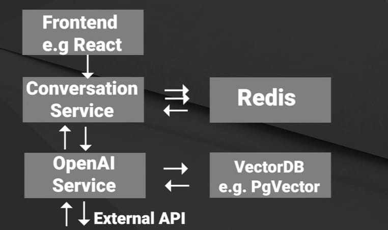

# Restaurant Chatbot Project

This project is a restaurant chatbot that is distributed across several microservices. The chatbot can answer general questions about the restaurant, such as operating hours, menu options, and health protocols.

## Services

The project consists of the following services:

1. **Frontend:** A React application that provides the user interface for interacting with the chatbot.

2. **Service2:** A Python (FastAPI)-based backend that coordinates the communication between the frontend and Service3. This service also manages the interaction history between the user and the chatbot.

3. **Service3:** Another Python (FastAPI)-based backend hosting the chatbot algorithm. This service communicates with the AI engine (OpenAI GPT-3.5-turbo) to process user queries and generate suitable responses.

4. **Redis:** A Redis server used for state storage across the services.

5. **Postgres:** A Postgres server acting as a database for storing vector embeddings.

## Setup

To get the project up and running, make sure Docker is installed on your system.

Then, run the following command:

```bash
docker-compose up
```

This command starts all services using the `docker-compose.yml` file. It downloads the necessary Docker images, creates associated containers, and gets them running together.

## Data Population

The provided `insert_data.py` script can be used to populate the Postgres database with your data. To do this, run the script once the services are up and running. It will connect to the Postgres service, create the necessary tables, and insert data into them.

## Env Variable

Rename the .env.example to .env and set your OpenAI API Key.

# LangChain on KuberNetes - Locally

1. Run Registry as Docker Container

`docker run -d -p 5000:5000 --name local-registry registry:2`

2. Build all images locally

```shell
docker build -t mypostgres ./postgres
docker build -t myservice2 ./service2
docker build -t myservice3 ./service3
docker build -t myfrontend ./frontend
```

3. Tag and push images

```shell
# For Postgres
docker tag mypostgres localhost:5000/mypostgres
docker push localhost:5000/mypostgres

# For Service2
docker tag myservice2 localhost:5000/myservice2
docker push localhost:5000/myservice2

# For Service3
docker tag myservice3 localhost:5000/myservice3
docker push localhost:5000/myservice3

# For Frontend
docker tag myfrontend localhost:5000/myfrontend
docker push localhost:5000/myfrontend
```
